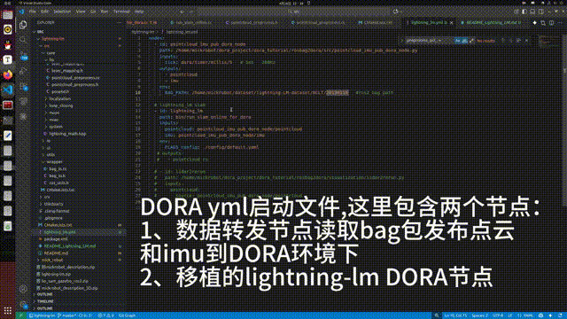

# Lightning-LM for DORA

该算法是在开源算法lightning-lm的基础上进行了去ROS化，增加了DORA框架的接口，在 [DORA 框架](https://github.com/dora-rs)下实现了建图和定位。开源代码链接：https://github.com/RuPingCen/lightning-lm

测试视频：https://www.bilibili.com/video/BV1tg9UBEEv6




### 环境配置

Ubuntu 22.04 或更高版本。lightning-lm 依赖库如下：

- DORA ≥ 0.4.0 
- Pangolin-0.9.3（用于可视化，见thirdparty）
- OpenCV
- PCL
- yaml-cpp
- glog
- gflags

其中，可视化库Pangolin可以解压 thirdparty 文件夹中的压缩包 Pangolin-0.9.3.zip ，安装Pangolin到系统中

```
unzip Pangolin-0.9.3.zip 
cd Pangolin
mkdir build
cd build
cmake ..
make 
sudo make install
```

###  数据集下载链接

数据集地址（ros2的db3格式）：

- OneDrive: https://1drv.ms/f/c/1a7361d22c554503/EpDSys0bWbxDhNGDYL_O0hUBa2OnhNRvNo2Gey2id7QMQA?e=7Ui0f5

- BaiduYun: https://pan.baidu.com/s/1XmFitUtnkKa2d0YtWquQXw?pwd=xehn 提取码: xehn

（测试视频使用的是NCLT数据集）

## DORA框架下启动节点

1、 修改Lightning-LM/CMakeLists.txt 中的第3行代码，将 BUILD_FRAMEWORK 设置为 DORA

​       修改Lightning-LM/CMakeLists.txt 中的第4行代码， set(DORA_ROOT "$ENV{HOME}/dora") 为实际电脑上dora仓库的目录

2、新建build文件夹，编译代码 DORA框架下的lightning-lm

```
cd lightning-lm
mkdir build
cd build 
cmake ..
make
```

3、启动DORA框架下的建图节点

修改yaml文件中变量BAG_PATH的值，指向数据包所在的绝对路径

```
dora up
dora run  dora_slam_online_node.yml
```

4、启动DORA框架下的定位节点

```
dora up
dora run  dora_loc_online_node.yml
```

注意: 

- 修改 dora_loc_online_node.yml 中传递给lightning-lm的配置文件 default_nclt_dora.yaml， 在 default_nclt_dora.yaml 文件中设置 “map_path:”地图存储的绝对路径。
- 修改yaml文件中变量BAG_PATH的值，指向ROS2数据包所在的绝对路径


##  修改说明

1、 把slam.cc中所有与ROS相关的代码(比如函数接口、ROS参数)移动到run_slam_online.cc、run_slam_offline.cc、run_loc_offine.cc 和 run_loc_online.cc中， 

2、 把loc_system.cc中所有与ROS相关的代码(比如函数接口、ROS参数)移动到 run_loc_online.cc run_loc_offline.cc

3、 localization/localization.cpp localization/localization.h 注释对ros 点云和livox点云消息类型支持，改为统一的输入接口   void Localization::ProcessLidarMsg(CloudPtr cloud) 

4、 在 run_loc_online.cc 增加了TF发布、轨迹、odom发布


5、 注释 core/lio/laser_mapping.h 中 preprocess_，以及处理处理ROS2和livox的点云函数 ProcessPointCloud2()


6、 添加ROS2和DORA编译脚本。编译时若需要编译为DORA环境下的节点，修改Lightning-LM/CMakeLists.txt 中的第3行代码，将 BUILD_FRAMEWORK 设置为DORA，反之设置为ROS2

7、去ROS化（修改了以下文件）

    src/common/options.h:14:10:  注释 rclcpp/rclcpp.hpp
    src/core/lightning_math.hpp  注释 头文件、函数 inline PoseRPYD SE3ToRollPitchYaw(const SE3& pose)  RpyToRotM(const T r, const T p, const T y)  . SE3ToRollPitchYaw函数被其他文件调用，这里对这个函数进行了修改
    src/wrapper/ros_utils.h
    src/core/g2p5/g2p5_map.h  注释 函数 nav_msgs::msg::OccupancyGrid G2P5Map::ToROS()
    src/core/localization/localization_result.cc
    slam.cc 注释 函数  存为ROS兼容的模式地图 if (options_.with_gridmap_) {xxxx}

